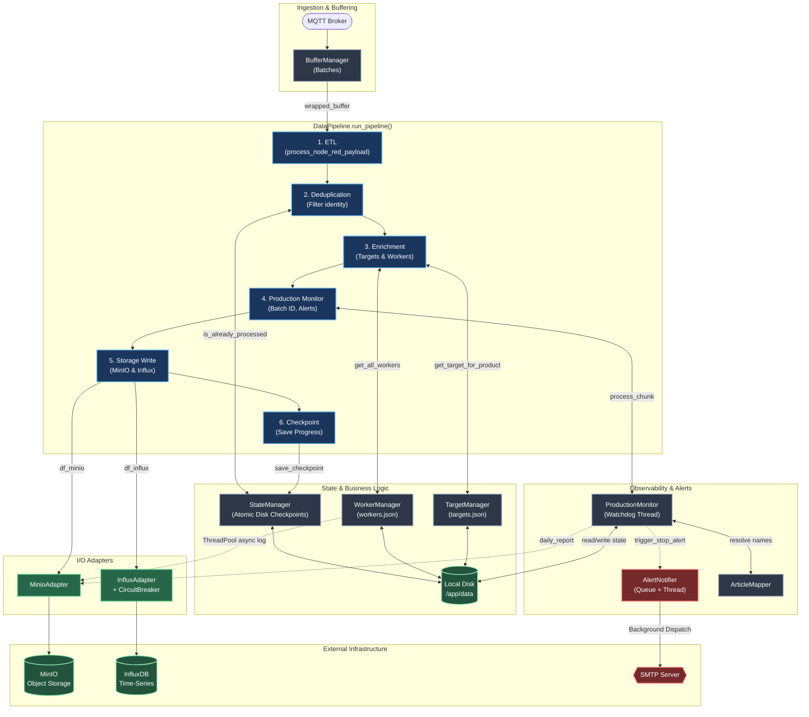
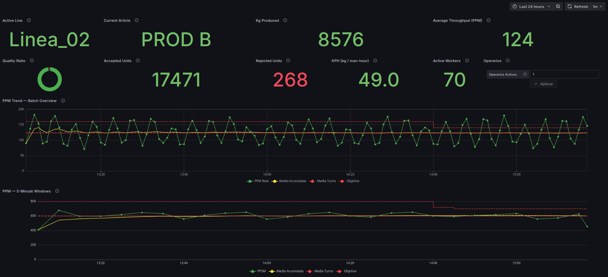
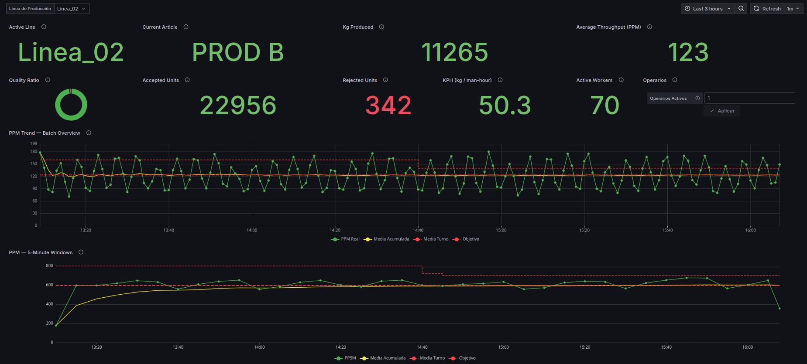
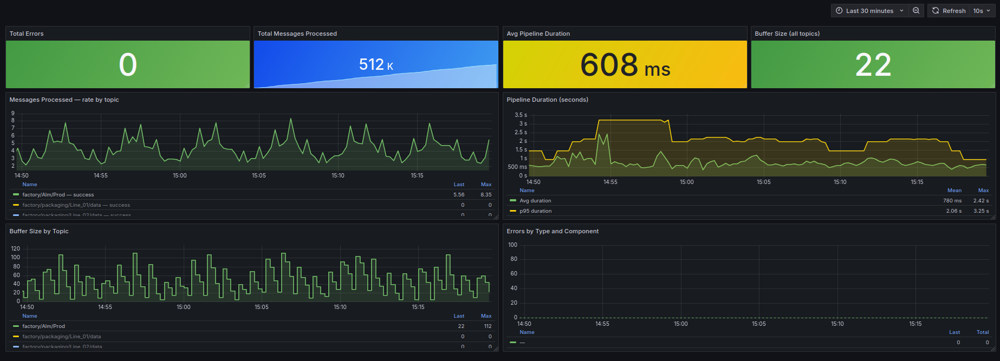

# IIoT Edge Gateway — Industrial Data Lake

> Deployed and validated inside a live agri-food production plant.  
> Not a demo. Not a simulation. Built during an internship, iterated under real failures.  
> **Validated in production by the plant's industrial engineer and used during daily operations.**

---

## About

**B.Sc. Computer Engineering** (finishing final year).  
Built and deployed this platform during an industrial internship, working directly
with the plant's resident engineer on the factory floor. Every design decision
in here came from a real failure, a real constraint, or a real operator complaint.
Validated in a live production environment.

Designed and implemented end-to-end by me (architecture, backend, data pipeline, monitoring),
with validation and feedback from the plant's industrial engineer.

Currently looking for roles in **IIoT / Edge Computing / Data Engineering**
for industrial environments.  
[LinkedIn](https://www.linkedin.com/in/joaquin-dominguez-garrido-2b96b0272/) · [Email](jdominguezg06@gmail.com)

---

## 🚀 TL;DR

Edge data platform deployed in a real agri-food production environment:

- Ingests real-time weighing data from industrial packaging lines via **MQTT**
- Implements **Lambda Architecture**: hot path (InfluxDB) for real-time dashboards, cold path (MinIO/S3) for full historical record, partitioned by line / date / article / batch
- Detects production anomalies autonomously: **line stops, article changes, product returns** — and sends email alerts to supervisors
- Survives hostile edge conditions: WiFi dropouts, HH:MM-only device timestamps, burst reconnection floods, Docker on WSL2

**Not a demo. Not a simulation. No rollback button.**  
Deployed in a live factory, under real failures, solving real production problems.

**Validated throughput:** 430K+ messages processed in under 30 minutes during deliberate stress testing (~14,000 msg/min ≈ 230 msg/sec sustained), with zero data loss and full DLQ routing for malformed payloads.

---

## Table of Contents

- [What it does](#what-it-does)
- [Architecture](#️-architecture)
- [Project Structure](#project-structure)
- [Technical Highlights](#technical-highlights)
- [Stack](stack)
- [Business Impact](#-business-impact)
- [Dashboards](#-dashboards)
- [Quick Start](#quick-start)
- [Configuration](#configuration)
- [Running the Tests](#running-the-tests)
- [API Reference](#api-reference)
- [Future Improvements](#️-future-improvements)
- [Looking for opportunities](#looking-for-opportunities)

---

## What it does

An **Edge Gateway** that ingests weighing data from industrial packaging lines (via MQTT), processes it through an ETL pipeline, and stores it across two paths simultaneously:

- **Hot path → InfluxDB**: clean, enriched time-series data for real-time Grafana dashboards
- **Cold path → MinIO**: raw and processed CSV files organised by line / date / product / batch for historical analysis

Beyond storage, the system provides active production monitoring:

- Detects **article changes** on each line and generates unique `batch_instance_id` identifiers
- Detects **product returns** (when an article that was already produced earlier reappears) and sends **email alerts**
- Detects **unexpected line stops** (>10 min of inactivity during working hours) and alerts the responsible supervisor
- Filters **false positives** caused by connectivity burst events (post-reconnect data dumps that look like stops)

---

## 🏗️ Architecture



### Lambda Architecture

Every MQTT message flows through both paths simultaneously and independently:

- **Hot path → InfluxDB**: cleaned, enriched time-series data available for Grafana queries within seconds of the weighing event. Tag-based indexing keeps dashboard queries lightweight even as data accumulates. **Aggregations run as InfluxDB Tasks** — pre-computed results are stored in a dedicated `aggregated_sensors` bucket, so Grafana queries never hit raw data directly, keeping dashboard latency low regardless of dataset size.
- **Cold path → MinIO**: raw and processed CSVs archived under a deterministic hierarchy — `packaging/{line}/{year}/{month}/{day}/{article}/{batch_id}/` — preserving the full historical record for reprocessing, auditing, or future migration to cloud analytics (same S3 API).

### Processing pipeline (inside the Worker)

Each batch follows a strict 6-stage sequence:

1. **ETL** — JSON normalisation, HH:MM timestamp parsing, deterministic jitter, weight cleaning, business enrichment
2. **Deduplication** — identity-based filtering via `StateManager`; counter rollover handled explicitly
3. **Enrichment** — live worker headcount (`WorkerManager`) and product weight targets (`TargetManager`) injected per record
4. **Production monitoring** — article-change detection, `batch_instance_id` assignment, inactivity watchdog, return detection, email alerts
5. **Write** — MinIO first, then InfluxDB; pipeline aborts and re-queues the batch if either write fails
6. **Checkpoint** — last processed identity persisted atomically to disk via `tempfile` + `os.replace`

---

## Project Structure

```
edge-gateway/
├── infra/
│   ├── docker-compose.yml              # Full stack definition
│   ├── .env.example                    # Required environment variables
│   ├── prometheus.yml                  # Prometheus scrape config
│   └── mosquitto/                      # MQTT broker config
│
└── src/worker/                         # Python Edge Worker
    ├── main.py                         # Entry point, Application class
    ├── config.py                       # Centralised config (env vars + Docker secrets)
    ├── requirements.txt
    ├── Dockerfile
    │
    ├── core/                           # Business logic
    │   ├── pipeline.py                 # Orchestrates the full processing flow
    │   ├── buffer_manager.py           # Thread-safe buffer + Dead Letter Queue
    │   ├── circuit_breaker.py          # Circuit Breaker pattern (InfluxDB protection)
    │   ├── state_manager.py            # Atomic checkpoints for deduplication
    │   ├── worker_manager.py           # Per-line worker count (hot-reload)
    │   ├── target_manager.py           # Per-product target weights (hot-reload)
    │   ├── api_server.py               # Lightweight HTTP API (/workers, /health)
    │   ├── logger.py                   # Structured logging (JSON + text)
    │   ├── etl.py                      # ETL orchestrator
    │   ├── processors.py               # Column normalisation, enrichment, output prep
    │   ├── timestamps.py               # Shift calculation, timezone handling
    │   ├── etl_config.py               # Column aliases, InfluxDB output schema
    │   └── common.py                   # Pure utility functions
    │
    ├── adapters/                       # External service adapters
    │   ├── minio_adapter.py            # MinIO (S3-compatible object storage)
    │   ├── influx_adapter.py           # InfluxDB time-series writes
    │   └── mqtt_client.py              # MQTT client with reconnect logic
    │
    ├── alerts/                         # Production monitoring
    │   ├── production_monitor.py       # Batch tracking, return detection, watchdog
    │   ├── production_alert.py         # Async email notifications (SMTP queue)
    │   └── article_mapper.py           # Article code → name mapping (hot-reload)
    │
    ├── simulators/                     # Manual testing & validation tools
    │   ├── simulate.py                 # MQTT data injector for manual testing
    │   ├── chaos_monkey.py             # Concurrent burst injector for stress testing
    │   ├── validate_config.py          # Pre-flight config validation
    │   ├── test_full_integration.py    # Logic + Email queue (Mocked MinIO validation)
    │   └── test_e2e_integration.py     # E2E test (requires Docker stack running)
    │
    └── tests/                          # Pytest unit & integration tests
        ├── test_api_server.py          # HTTP routing, health endpoints, CORS isolation
        ├── test_article_mapper.py      # Config generation, hot-reloading, DF mapping
        ├── test_buffer_manager.py      # Concurrency, DLQ, batch triggering
        ├── test_circuit_breaker.py     # State machine, fast-fail, HALF_OPEN recovery
        ├── test_common.py              # Vectorised numeric coercion, key normalisation
        ├── test_etl.py                 # Schema validation, jitter, garbage tolerance
        ├── test_influx_adapter.py      # TSDB formatting, synthetic indices, graceful shutdown
        ├── test_minio_adapter.py       # Bucket creation, smart filenames, CSV/JSON archiving
        ├── test_mqtt_client.py         # Connection lifecycle, backoff, subscription callbacks
        ├── test_pipeline.py            # Orchestrator flow, dependency injection, storage dispatch
        ├── test_production_alert.py    # SMTP mocking, email queue, HTML template rendering
        ├── test_production_monitor.py  # Article-change detection, return alerts, multi-line segregation
        ├── test_production_monitor_watchdog_io.py # Watchdog isolation, shift boundaries, disk I/O
        ├── test_state_manager.py       # Atomic checkpoints, deduplication, rollover
        ├── test_target_manager.py      # Default config, hot-reloading cache, priority enrichment
        ├── test_timestamps.py          # Shift calculation, timezone conversions
        └── test_worker_manager.py      # Atomic config updates, async MinIO logging, enrichment
```

---

## Technical Highlights

These are the non-trivial problems that came up in production and how they were solved.
Each one has a concrete origin: a real failure, a real data anomaly, or a failure mode
that would have been expensive to discover later.

### Summary

| Challenge | Solution | Operational result |
|---|---|---|
| InfluxDB crashes → thread exhaustion + data loss | Circuit Breaker (CLOSED/OPEN/HALF_OPEN) | Self-healing, zero data loss during DB outages |
| Container restarts → duplicate or missing records | Atomic checkpoints (`tempfile` + `os.replace`) | Exact resume after any restart, planned or not |
| WiFi reconnect bursts → false stop alerts | Server-lag detection against device timestamp | False positives eliminated from alerting system |
| HH:MM-only timestamps → InfluxDB silent overwrites | Timezone-aware parsing + deterministic jitter | No silent data loss from timestamp collisions |
| Global lock on buffer → cross-line backpressure | Per-topic granular locks + DLQ retry | Lines fully isolated; one slow line cannot block others |
| No visibility into line stops | Background watchdog + 4 false-positive filters | Reduced stop detection from end-of-shift discovery to < 10 min |

---

### 1. Circuit Breaker — InfluxDB protection

**The problem.** InfluxDB crashed repeatedly during early development — partly from
tag cardinality mistakes (using record IDs as tags), partly from Docker/WSL2
instability. The real damage wasn't the crash itself: the Python worker kept
hammering a service that wasn't responding, exhausting threads and losing every
record it tried to write with no recovery path.

**The solution.** A thread-safe Circuit Breaker with three states: `CLOSED` (normal),
`OPEN` (fast-fail after `N` consecutive failures), and `HALF_OPEN` (single probe after
timeout). The full state machine runs under a single `threading.Lock` — no race between
the failure counter and the state transition.

```python
# circuit_breaker.py — state transition on failure
if self.failures >= self.failure_threshold:
    self.state = CircuitState.OPEN
    logger.error(f"Circuit OPEN — threshold reached ({self.failures}/{self.failure_threshold})")
```

When the circuit is OPEN, calls raise `CircuitOpenError` immediately — the batch is
returned to the `BufferManager` for retry rather than dropped. After `timeout` seconds
the circuit enters `HALF_OPEN` and allows one probe through; success resets to CLOSED,
failure restarts the timer.

**Operational result.** InfluxDB outages no longer cause data loss. The buffer absorbs
the backpressure, the circuit prevents thread exhaustion, and the system self-heals
without manual intervention.

---

### 2. Atomic checkpoints — cross-restart deduplication

**The problem.** Every container restart wiped the last-processed record ID from memory.
On restart, the system had no way to know where it left off — it would either reprocess
records (duplicates in InfluxDB) or skip records (gaps in the time-series). The only
recovery was a manual lookup in MinIO to find the last valid identity, which was not
acceptable in production.

**The solution.** The `StateManager` persists the last processed `identity` value per
MQTT topic to disk after every successful batch. The write uses `tempfile` +
`os.replace` — the filesystem never sees an intermediate state.

```python
# state_manager.py — atomic write
with tempfile.NamedTemporaryFile(mode="w", dir=dirname, delete=False,
                                  prefix=".checkpoint_", suffix=".tmp") as tmp_file:
    json.dump(state_data, tmp_file, indent=4, ensure_ascii=False)
    tmp_name = tmp_file.name

os.replace(tmp_name, Config.CHECKPOINT_FILE)
```

Deduplication is identity-based with explicit rollover handling: if the gap between
the stored identity and the incoming one exceeds `Config.ROLLOVER_THRESHOLD`, the
record is treated as new rather than a duplicate — preventing counter wraps from
silently dropping valid data.

**Operational result.** The system resumes exactly where it left off after any restart —
planned or not. Zero duplicates, zero gaps, zero manual intervention.

---

### 3. Connectivity burst detection — suppressing false stop alerts

**The problem.** Production lines lost WiFi intermittently. On reconnect, devices
flushed all buffered records at once — sometimes hundreds of records covering the
last 8 hours. The system saw the preceding silence as a line stop and fired an
alert to the supervisor. The alert was wrong: the line had been running the whole
time, just disconnected.

**The solution.** Every incoming record already carries two timestamps: `Timestamp`
(marked at weighing time by the device) and `CreationDateServer` (arrival time at
the broker). The lag between them is the connectivity gap. If the lag exceeds
`LAG_THRESHOLD_SECONDS` (15 minutes), the watchdog suppresses the stop alert for
that line.

```python
# production_monitor.py — burst suppression in the watchdog
last_lag = state.get("last_connection_lag_seconds", 0.0)
if last_lag > self.LAG_THRESHOLD_SECONDS:  # 900 seconds
    logger.info(
        f"Stop suppressed for '{key}': server lag {last_lag / 60:.1f}min "
        "suggests post-WiFi reconnection burst"
    )
    continue
```

The threshold was calibrated against real reconnection events observed in the plant —
not an arbitrary value.

**Operational result.** Supervisors stopped receiving false stop alerts after WiFi
dropouts. Signal-to-noise ratio on the alerting system went from unusable to reliable.

---

### 4. HH:MM timestamp normalisation + deterministic jitter

**The problem.** Industrial weighing scales emit timestamps as `HH:MM` strings — no
date, no seconds, no timezone. Two separate issues follow from this. First,
`pd.to_datetime()` silently coerces `HH:MM` strings to `NaT`, so the timestamp
parsing step had to run before any pandas cleaning touched the column. Second,
multiple records from the same minute are identical after parsing — InfluxDB uses
timestamp as the primary key, so they would silently overwrite each other.

**The solution.** A dedicated parsing step runs before all other ETL transformations.
It combines the `HH:MM` string with today's date in the factory timezone
(`Europe/Madrid`) and converts to UTC. Then a deterministic microsecond offset
derived from the record's `identity` field is added — same identity always produces
the same offset, so the operation is idempotent across retries.

```python
# etl.py — deterministic jitter
offset_us = df["identity"] % 10_000_000
df["timestamp"] = base_times + pd.to_timedelta(offset_us, unit="us")
```

**Operational result.** No silent data loss from timestamp collisions in InfluxDB.
The jitter is invisible to Grafana queries (sub-second offsets on minute-resolution
data) but meaningful to InfluxDB's write model.

---

### 5. Granular locking — per-topic buffer concurrency

**The problem.** A single global lock on the buffer would have serialised all MQTT
topics — a slow write on Line 3 would block ingestion on Lines 1, 2, and 4. With
6+ active packaging lines sending data simultaneously, this would create artificial
backpressure that had nothing to do with actual load.

**The solution.** Each topic gets its own dedicated `threading.Lock` created at first
insert. The global lock is held only for the short critical section of checking
whether a topic entry exists — never for the actual data operations.

```python
# buffer_manager.py — granular lock creation
def _get_or_create_entry(self, topic: str) -> dict:
    with self._global_lock:          # held only for existence check
        if topic not in self.buffers:
            self.buffers[topic] = self._make_buffer_entry()  # own lock per topic
        return self.buffers[topic]
```

Failed batches are re-queued rather than dropped: `restore_buffer` prepends them
back to the topic buffer with an incremented attempt counter. After `_max_retries`
attempts the record goes to the Dead Letter Queue (DLQ) — a local JSON file — for
offline analysis without blocking the pipeline.

**Operational result.** Lines process independently. A slow or failed write on one
line has zero impact on the others. The DLQ provides a recovery path for messages
that would otherwise be silently lost.

---

### 6. Production watchdog — autonomous line stop detection

**The problem.** Supervisors had no visibility into unexpected line stops during the
shift. The only detection mechanism was an operator noticing the line was quiet —
which could mean 30+ minutes of lost production before anyone reacted.

**The solution.** A background `StopWatchdog` thread runs independently of the
ingestion pipeline, checking every 60 seconds whether any tracked line has been
silent longer than `STOP_THRESHOLD_SECONDS` (10 minutes). It fires an email alert
to the responsible supervisor with the line ID, last known article, and silence
duration.

The watchdog has four built-in false-positive filters calibrated against real plant
behaviour:

- **Day change barrier** — overnight silence does not trigger an alert at shift start
- **Lunch barrier** — 13:30–15:00 silence is expected and suppressed
- **Afternoon barrier** — prevents post-lunch false positives when the morning article is still the last seen
- **WiFi burst barrier** — high server lag (>15 min) indicates a reconnection event, not a real stop (see Highlight 3)

Alert deduplication is handled inside `_global_lock`: the `stop_alert_sent` flag is
set to `True` before releasing the lock, so concurrent watchdog cycles cannot fire
duplicate emails for the same event. Email and disk I/O happen outside the lock to
avoid blocking the ingestion pipeline.

**Operational result.** Supervisors receive one alert per stop event, reliably, within
10 minutes of the line going silent — with no false positives from WiFi outages,
lunch breaks, or overnight gaps.

---

## Stack

| Layer | Technology | Why this, not something else | Version |
|---|---|---|---|
| **Messaging** | Mosquitto | MQTT is the industrial standard for constrained networks — lightweight, async, and native to most PLCs and devices. HTTP polling would have missed burst events. | 2.0.18 |
| **Orchestration** | Node-RED | Low-code routing layer between the devices and the broker. Kept deliberately thin — business logic lives in the Python worker, not here. | 4.0.5 |
| **Edge Computing** | Python Worker | Full control over concurrency, state management, and error handling. No framework overhead. Hexagonal architecture for testability. | 3.9 |
| **Cold Path** | MinIO | S3-compatible object storage (same API as AWS S3) deployable on-premise. Chosen over a shared filesystem for structured partitioning by line / date / product / batch and future cloud migration compatibility. | RELEASE.2024 |
| **Hot Path** | InfluxDB | Purpose-built for time-series. Tag-based indexing and **Tasks** (scheduled Flux queries) pre-aggregate metrics into a dedicated `aggregated_sensors` bucket, offloading computation from Grafana. TimescaleDB was considered but InfluxDB's native Grafana integration and lower ops overhead won. | 2.7 |
| **Dashboards** | Grafana | Native InfluxDB datasource, shift-aware time ranges, and alerting. Operators use it directly — no data team required. | 11.4.0 |
| **Metrics** | Prometheus | Standard scraping for worker internals (buffer depth, circuit breaker state, batch latency). Decoupled from the business logic. | v2.51.0 |
| **Infrastructure** | Docker Compose | Constraint-driven choice: Windows host, no dedicated Linux server. WSL2 + Compose was the pragmatic path. Architecture is migration-ready — a Linux host or K3s edge cluster would be a drop-in replacement. | — |

---

## 📈 Business Impact

| Problem before | What this system does | Outcome |
|---|---|---|
| No visibility into active lines | Real-time Grafana dashboards from live weighing data | Operators monitor production without manual checks |
| Line stops discovered at end of shift | Background watchdog + email alert on inactivity | Reduced stop detection from end-of-shift discovery to < 10 minutes |
| Product returns caught manually (or not at all) | Automated cross-line return detection | Immediate alert on reappearance of a closed batch |
| KPIs calculated manually in spreadsheets | Kilos/person/hour computed live from weighing data + headcount | Available in Grafana, updated by operators without technical intervention |
| Data lost or duplicated during WiFi outages | Circuit Breaker + atomic checkpointing + DLQ | 100% data retention validated under real connectivity failures and deliberate stress injection (430K+ messages at ~14,000 msg/min ≈ 230 msg/sec sustained) |
| No historical record of production runs | Full raw + processed archive in S3-compatible storage, partitioned by line/date/article/batch | Foundation for future analytics, audits, or cloud migration |

---
 
## 📊 Dashboards
 
Three Grafana dashboards running in the production plant, querying pre-aggregated data from InfluxDB Tasks (no raw data queries at dashboard level):
 
### Zero-Touch Production View (InfluxDB)
 
Designed for line supervisors and warehouse managers who need instant visibility without any interaction. The dashboard auto-updates as new batches are detected: it reads the first and last registered package of the current batch and refreshes automatically — no manual input required. At a glance: active line, current article, kg produced, accepted/rejected units, quality ratio, KPH, active workers, and PPM trend vs shift target.
Used directly by line supervisors during live production to monitor performance without manual input, eliminating the need for spreadsheet-based tracking.
 

 
### Production Dashboard — Line Selector (InfluxDB)
 
Intended for industrial engineers and line supervisors who need to monitor or review specific lines. The active line is switched directly via a Grafana variable dropdown — no dashboard duplication needed. Same production KPIs as the Zero-Touch view, but operating on a configurable time window, making it suitable for shift reviews and intra-day comparisons.
Enabled engineers to compare performance across lines and shifts in real time, replacing manual post-shift analysis.
 

 
### System Health — Worker Internals (Prometheus)
 
Real-time visibility into pipeline performance scraped from the Python worker's Prometheus endpoint. Shows total messages processed, average pipeline duration, p95 latency, buffer depth per topic, throughput rate by MQTT topic, and error counts by type and component. Used to detect backpressure, circuit breaker trips, or unexpected drops in ingestion rate.
Used to detect ingestion slowdowns, buffer buildup, and circuit breaker events before they impacted production visibility.
 

 
---

## Quick Start

### Prerequisites
- Docker Desktop running
- Git

### 1. Clone the repository
```bash
git clone <YOUR_REPO_URL>
cd edge-gateway
```

### 2. Configure environment variables
```bash
cp infra/.env.example infra/.env
# Edit infra/.env with your values
```

### 3. Start the full stack
```bash
cd infra
docker compose up -d
```

### 4. Verify everything is running
```bash
docker compose ps
curl http://localhost:8765/health
```

### 5. Access the interfaces

| Service | URL | Default credentials |
|---|---|---|
| Grafana | http://localhost:3000 | admin / (from .env) |
| MinIO Console | http://localhost:9090 | (from .env) |
| InfluxDB | http://localhost:8086 | (from .env) |
| Node-RED | http://localhost:1880 | — |
| Worker API | http://localhost:8765 | — |
| Prometheus metrics | http://localhost:9091 | — |

### 6. Inject test data
```bash
docker exec -it edge_worker python3 simulators/simulate.py
```

---

## Configuration

All configuration is injected via environment variables — no credentials hardcoded anywhere in the source. Docker Secrets are supported for sensitive values (`MINIO_PASSWORD_FILE`, `INFLUX_TOKEN_FILE`), following the principle of least privilege at the container level.

Copy `.env.example` to `.env` and fill in your values.

| Variable | Description | Default |
|---|---|---|
| `MQTT_BROKER` | MQTT broker hostname | `mosquitto` |
| `MQTT_TOPIC` | Topic subscription pattern | `factory/#` |
| `MINIO_ENDPOINT` | MinIO endpoint | `minio:9000` |
| `MINIO_BUCKET` | Target bucket name | `raw-data` |
| `INFLUX_URL` | InfluxDB URL | `http://influxdb:8086` |
| `BATCH_SIZE` | Records per processing batch | `100` |
| `BATCH_TIMEOUT` | Flush interval in seconds | `10` |
| `SMTP_HOST` | SMTP server for email alerts | `smtp.gmail.com` |
| `LOG_FORMAT` | `json` or `text` | `json` |
| `LOG_LEVEL` | `DEBUG`, `INFO`, `WARNING` | `INFO` |

---

## Running the Tests

The test suite covers four levels — from isolated unit tests to full chaos injection under a live Docker stack. Integration and E2E tests run against real InfluxDB, MinIO, and MQTT instances — no mocks for external services at those levels.

**Unit tests** (no external services required):
```bash
docker exec -it edge_worker python3 -m pytest tests/ -v
```

**Full test suite** including integration (mocked external services):
```bash
docker exec -it edge_worker python3 -m pytest tests/ simulators/test_full_integration.py -v
```

**E2E test** (requires the full Docker stack running):
```bash
docker exec -it edge_worker python3 -m pytest simulators/test_e2e_integration.py -v
```

**Stress test — Chaos Monkey** (injects malformed JSON, burst floods at ~20 msg/s per line, and out-of-bounds weights across 3 concurrent lines to validate DLQ routing, buffer overflow handling, and circuit breaker trips):
```bash
docker exec -it edge_worker python3 simulators/chaos_monkey.py
```

### What the tests cover

| Module | Test file | Key scenarios |
|---|---|---|
| `BufferManager` | `test_buffer_manager.py` | Batch threshold, DLQ on bad JSON, overflow protection, 10-thread concurrent stress (1000 messages), timeout-based flush, retry exhaustion → DLQ |
| `CircuitBreaker` | `test_circuit_breaker.py` | CLOSED→OPEN on threshold, HALF_OPEN recovery on success, immediate re-OPEN on probe failure |
| `StateManager` | `test_state_manager.py` | Atomic checkpoint write+read, deduplication logic, PLC counter rollover (0 after 999999), string identity coercion |
| `ETL` | `test_etl.py` | Schema validation, HH:MM jitter (collision prevention + <1s deviation), garbage data resilience (no crash) |
| `Timestamps` | `test_timestamps.py` | Shift boundary assignments (Morning/Afternoon), missing column recovery, invalid value fallback, UTC→local export conversion |
| `Common` | `test_common.py` | European decimal coercion (`500,5` → `500.5`), error coercion to NaN, Node-RED key prefix stripping (`values.`) |
| `ProductionMonitor` | `test_production_monitor.py` | Continuous production (no false alerts), article-change detection, cross-line global return alert, multi-line concurrent segregation |

---

## API Reference

The worker exposes a lightweight HTTP API on port `8765`.

### `GET /health`
Returns the real-time connection status of MQTT and InfluxDB.

```json
{
  "status": "healthy",
  "mqtt": true,
  "influx": true,
  "timestamp": "2025-04-01T10:30:00Z"
}
```

### `GET /workers`
Returns the current worker count configuration per line.

```json
{
  "Line_A": 3,
  "Line_B": 4
}
```

### `POST /workers`
Updates the worker count for a specific line. Changes persist to disk and take effect immediately.

```json
{
  "line_id": "Line_A",
  "workers": 5
}
```

> **Security trade-off:** In this Edge deployment the API operates within a trusted OT VLAN with no external exposure, making auth overhead unnecessary at this layer. For enterprise-scale deployment, JWT authentication and TLS termination would be enforced at the API gateway level.

---

## Where this experience applies

- Industry 4.0 / Smart Factory systems
- Edge computing in unreliable networks
- Real-time industrial monitoring
- Data pipelines bridging OT and IT

---

## Future Improvements

- Migration from Docker Compose to **K3s** (lightweight Kubernetes for edge clusters)
- **TLS + JWT** authentication layer for API exposure outside the OT VLAN
- Schema evolution handling for device firmware updates (breaking field renames)
- Stream processing upgrade — **Kafka / Redpanda** for higher-throughput scenarios
- Cloud sync — **AWS S3 + Athena / Iceberg** (MinIO's S3-compatible API makes this a near-drop-in migration)
- Grafana alerting integration (currently email-only via SMTP)

---

## Looking for opportunities

I'm actively looking for roles where I can apply this experience in real industrial environments, especially in:

- **IIoT / Edge Computing**
- **Data Engineering** (industrial / manufacturing context)
- **Backend systems** handling real-time data at the edge

 [LinkedIn](https://www.linkedin.com/in/joaquin-dominguez-garrido-2b96b0272/) · [Email](jdominguezg06@gmail.com)

---

## License

Deployed and validated in a real industrial production environment during an engineering internship. All production data has been anonymised.
